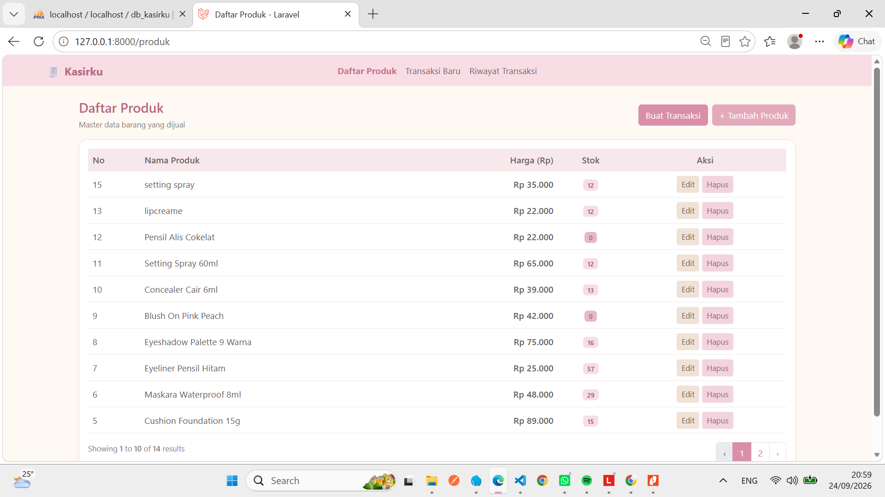
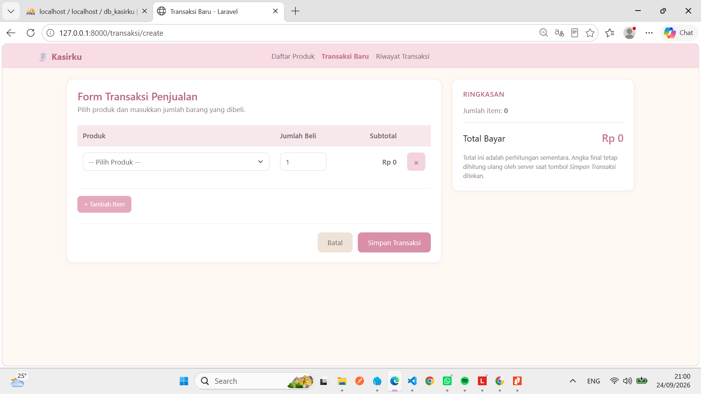
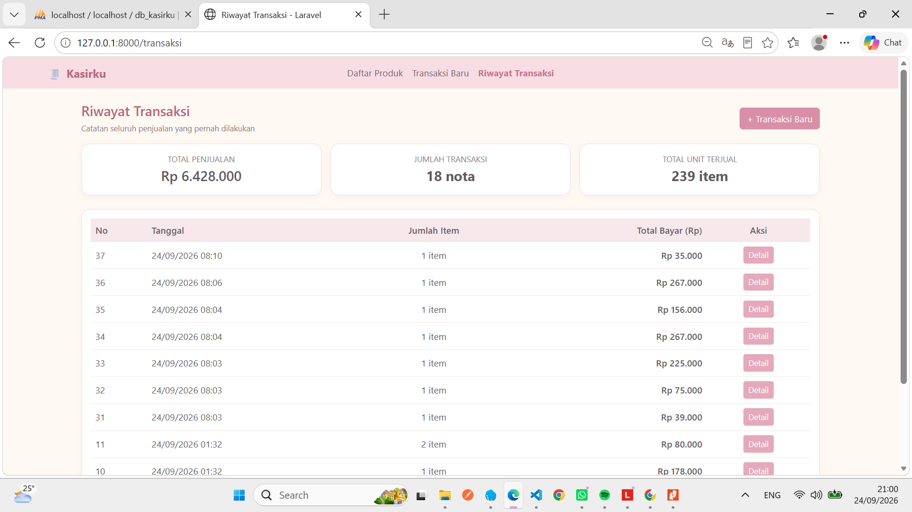

# KasirKu

Aplikasi web kasir sederhana berbasis Laravel untuk mencatat transaksi penjualan:
daftar produk, form transaksi, penyimpanan ke database, dan riwayat transaksi.

## Cara Instalasi
1. Clone repo: `git clone https://github.com/lovelyputri/serkom.git` lalu `cd serkom`
2. `composer install`
3. `cp .env.example .env` lalu `php artisan key:generate`
4. Buat database `db_kasirku` di phpMyAdmin (XAMPP/Laragon), lalu cek pengaturan `DB_*` di `.env`
5. `php artisan migrate --seed`
6. `php artisan serve` lalu buka http://127.0.0.1:8000

## Struktur Folder
```
app/Http/Controllers/   ProdukController, TransaksiController
app/Models/             Produk, Transaksi, DetailTransaksi
database/migrations/    tabel produk, transaksi, detail_transaksi
database/seeders/       ProdukSeeder (data contoh)
resources/views/        layouts, produk, transaksi (Blade)
routes/web.php          daftar route
tests/Unit/KasirTest.php
```

## Daftar Route
| Method | URL | Fungsi |
|--------|-----|--------|
| GET | / , /produk | Daftar produk |
| GET/POST | /produk/create, /produk | Tambah produk |
| GET/PUT | /produk/{id}/edit, /produk/{id} | Ubah produk |
| DELETE | /produk/{id} | Hapus produk |
| GET | /transaksi/create | Form transaksi |
| POST | /transaksi | Simpan transaksi |
| GET | /transaksi | Riwayat transaksi |
| GET | /transaksi/{id} | Detail transaksi |

## Fungsi Utama (TransaksiController)
- `hitungSubtotal($harga, $jumlah)` : menghitung harga x jumlah
- `hitungTotalBayar($subtotal)` : menjumlahkan semua subtotal
- `kurangiStok($produk_id, $jumlah)` : mengurangi stok, error jika stok kurang/minus
- `store()` : validasi input, simpan transaksi dan detail dalam satu DB transaction

## Pengujian
`php artisan test`

## Screenshot



